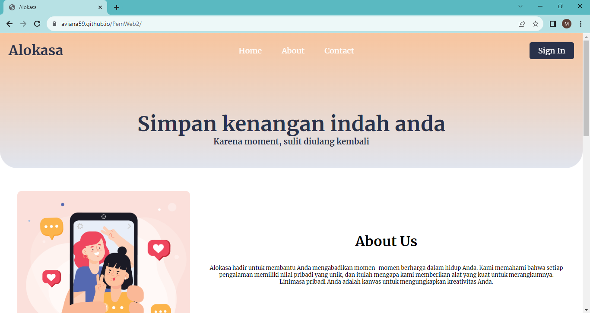
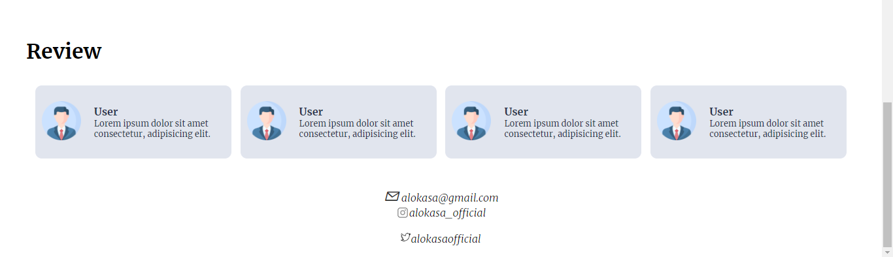
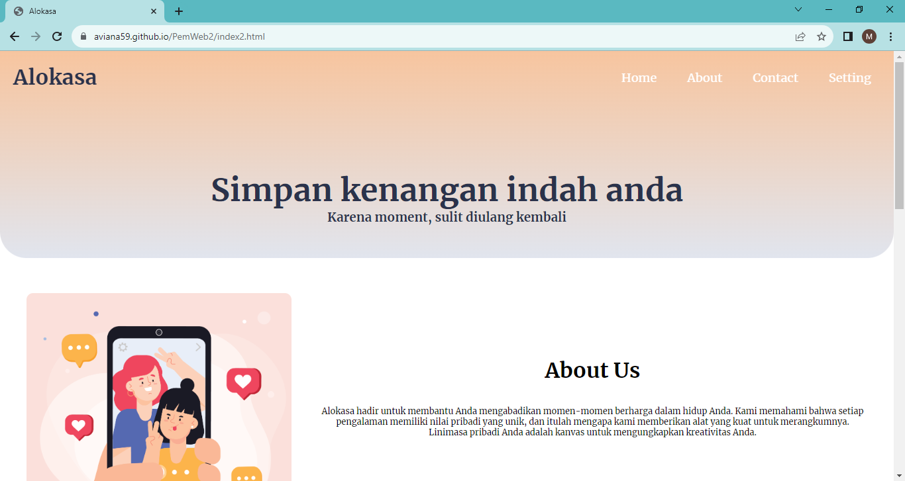
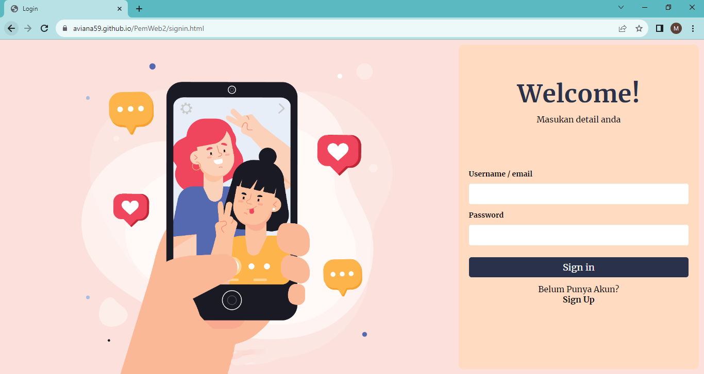
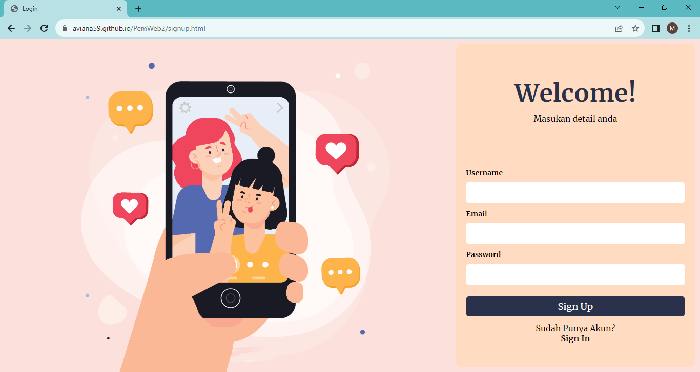
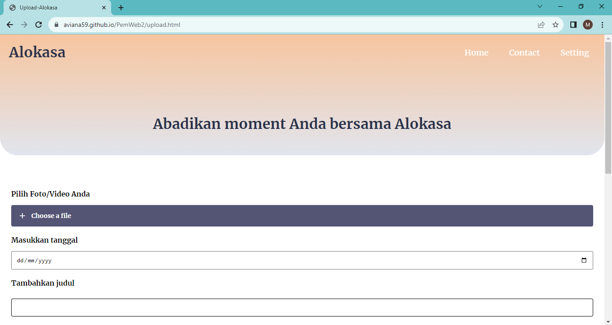
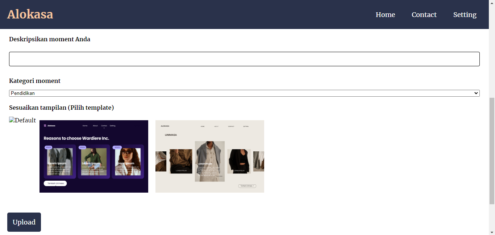
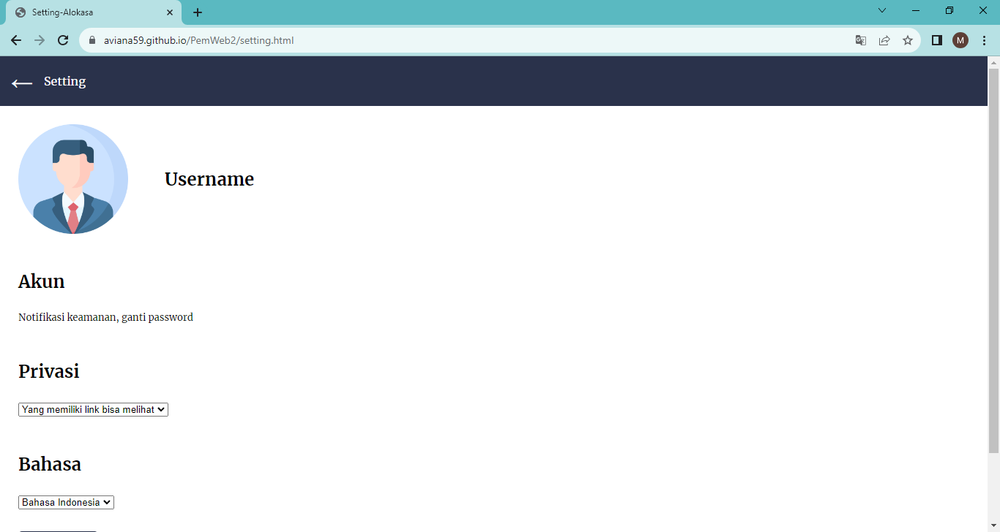
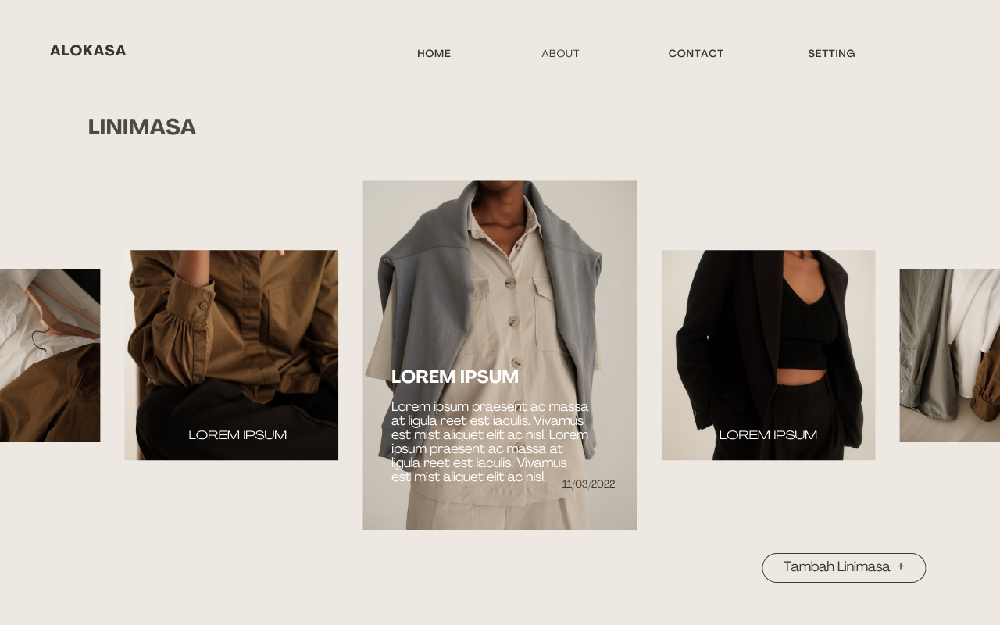

# WEBSITE ALOKASA

## Perspektif Produk
Website Alokasa merupakan website untuk membuat linimasa baik pribadi atau organisasi. Nama Alokasa sendiri diambil dari kata “aloka” dari bahasa sansekerta yang berarti cahaya dan “samsara” yang biasa disebut dalam beberapa agama seperti Hindu dan Budha untuk menggambarkan siklus hidup. Sehingga nama Alokasa sendiri bisa diartikan siklus hidup yang penuh cahaya yang dianggap relevan dengan website yang kami rancang untuk memberi ruang kepada semua orang agar bisa membuat jejak digital berupa linimasa di dalam website yang bisa terus diupdate dan dibuka kembali. Privasi pengguna website ini terjaga dengan artian linimasa pengguna tidak akan ditampilkan kepada pengguna lain, tapi pengguna tetap bisa membagikan linimasanya kepada orang-orang tertentu saja melalui link yang di generate dari situs web ini. Situs web ini dirancang sebagai sistem yang mandiri, bukan anggota lanjutan dari aplikasi atau situs website lainnya. 

## Tujuan
Dokumen ini merupakan Spesifikasi Kebutuhan Perangkat Lunak (SKPL) atau Software Requirement Specification (SRS) untuk Website Alokasa. Tujuan dari penulisan dokumen ini ada.lah untuk memberikan penjelasan mengenai website yang akan dibangun baik berupa gambaran umum maupun penjelasan detail dan menyeluruh. Pengguna dari dokumen ini adalah para pengembang (developer) perangkat lunak aplikasi pengumpulan tugas dan pengguna (user) dari perangkat lunak ini atau mereka yang terlibat dalam sistem. Dokumen ini akan digunakan sebagai bahan acuan dalam proses pengembangan dan sebagai bahan evaluasi pada saat proses pengembangan perangkat lunak maupun di akhir pengembangannya. Dengan adanya dokumen SKPL ini diharapkan pengembangan perangkat lunak akan lebih terarah dan lebih terfokus serta tidak menimbulkan ambiguitas terutama bagi pengembang perangkat lunak ini.

## Fungsi Produk
A. Sistem 
   1. Upload Foto
      Sistem menyediakan fitur upload untuk mengunggah foto yang akan disimpan ke dalam alokasa sebagai arsip untuk kenangan-kenangan yang dapat dilihat kapanpun dimanapun.
   2. Penggunaan Template
      Sistem dalam alokasa menyediakan template untuk mengedit foto ataupun dibuat video. Template yang menarik akan membuat arsip foto yang diupload pengguna lebih indah. Pengguna juga dapat membuat sendiri templatenya sesuai keinginan.
   3. Tambah Deskripsi singkat
      Alokasa memiliki fitur deskripsi singkat untuk memberikan keterangan terhadap foto yang akan diupload sebagai penanda ataupun pengingat momen yang diabadikan dan disimpan arsip di alokasa.
   4. Kategori foto
      Fitur kategori foto ini untuk mengkategorikan foto-foto yang pengguna upload di Alokasa sehingga teroganisir sesuai dengan kategori yang diberikan.
      
B. Pengguna
   1. Fungsi Upload Foto
      Pengguna dapat mengupload foto yang akan dijadikan arsip sebagai kenangan kenangan.
   2. Fungsi Template
      Template ini dapat digunakan pengguna untuk mengedit foto foto mereka agar terlihat lebih indah. Pengguna juga dapat membuat sendiri template yang ingin digunakan sesuai dengan kreasi pengguna.
   3. Fungsi Deskripsi Singkat
      Deskripsi singkat dapat ditambahkan oleh pengguna untuk memberikan keterangan atau tanda foto agar dapat diingat momen yang diabadikan
   4. Fungsi Kategori
      Fungsi kategori dapat dibuat oleh pengguna untuk mengorganisir foto yang sudah diupload. Seperti foto sendiri, keluarga, teman, sahabat, dapat juga kategori seperti tempat atau suasana.
      
## Karakteristik Pengguna
Analisis pengguna sistem dimaksudkan untuk mengetahui siapa saja aktor yang terlibat dalam menjalankan sistem. Website linimasa ini sendiri menggunakan platform web browser. Pengguna sistem ini yaitu  individu atau organisasi dengan menggunakan username  yang terdaftar di dalam sistem. Pengguna harus memiliki koneksi internet  dan akun email yang digunakan untuk membuat akun di Alokasa.

## Lingkungan Operasi
Website ini dirancang untuk bisa diakses di web browser. Untuk itu diperlukan sebuah platform untuk mendukung pembuatan website ini. Platform yang digunakan untuk membuat website ini ada software VS Code dengan menggunakan HTML, CSS, dan Java Script untuk membuat tampilan website, blablabla untuk membuat program yang berjalan dibalik layar, serta blablabla untuk database sistem.

## Flowchart


Proses dimulai dengan user mengupload foto pada form yang disediakan.Setelah foto dipilih, maka user akan memilih apakah memakai template bingkai yang telah disediakan atau lewati proses tersebut dan langsung menuju proses selanjutnya.Jika user memilih untuk memakai bingkai yang disediakan, maka user akan melakukan proses editing untuk menyesuaikan foto yang telah diupload dengan bingkai yang telah dipilih.Setelah melakukan editing maka user dapat memberikan deskripsi pada foto tersebut untuk memberikan konteks atau hanya sebagai pelengkap.Lalu user melakukan konfirmasi untuk mengupload foto, dan setelah itu user akan memilih apakah perlu melakukan upload lagi atau tidak.
Jika memilih untuk melakukan upload lagi, maka akan mengulang proses-proses sebelumnya.Lalu akan ada pemilihan kategori oleh user untuk mempermudah melakukan navigasi pada linimasa yang telah dibuat nantinya.Proses terakhir adalah pemilihan apakah user akan membuat foto foto yang telah diupload dapat diakses oleh publik atau tidak.Jika iya maka server akan mengonfirmasi dan membuat foto foto tersebut terbuka ke publik, jika tidak maka proses telah selesai.

## Usecase Diagram


Pengguna : Orang yang mengakses website, melakukan upload foto, memilih template, editing, menambahkan deskripsi, dan menentukan kategori foto tersebut.

Admin : Merupakan orang yang melakukan pemeliharaan dan shutdown website jika diperlukan

Server : Server berfungsi sebagai penyedia tampilan website, database penyimpan foto, penyedia template bingkai, dan media untuk menampilkan foto dari pengguna ke publik (jika user memilih opsi publikasi)

Foto : Pengguna melakukan proses upload foto.proses ini dilakukan dalam bentuk form dimana pengguna akan memilih foto lewat file explorer mereka.

Penambahan Deskripsi : Pengguna dapat menambah deskripsi pada foto untuk mengingat latar belakang dari foto tersebut sebagai kenang-kenangan (opsional)

Penentuan Kategori : Pengguna juga memilih kategori dari foto tersebut untuk mempermudah melakukan navigasi pada arsip foto foto yang telah diupload

Template dari Web : Pengguna disediakan dengan template dari server untuk digunakan sebagai bingkai.Setelah memilih template, pengguna dapat menyesuaikan foto dengan template agar terlihat bagus.

File yang terupload : file yang telah diedit akan disimpan sementara sebelum konfirmasi upload agar pengguna dapat melihat seperti apa foto yang telah diubah (jika pengguna memakai template) beserta tampilan deskripsi dan kategori yang dipilih.

Publikasi ke internet : pengguna dapat memilih untuk membuat foto/album terlihat oleh publik.

## Activity Diagram


## Tampilan Web
- Index
  
  
  
  
- Index2
  
  
  
  
- Sign In
  
  
- Sign Up
  
  
- Upload
  
  
  
- Setting
  

## Penjelasan Program
### Index
#### Tag Head
- Kode HTML ini memuat file CSS `style.css` dan memuat font dari Google Fonts. Font yang dimuat adalah font Merriweather.
```
    <meta charset="UTF-8">
    <meta name="viewport" content="width=device-width, initial-scale=1.0">
    <link rel="stylesheet" href="assets/css/style.css">
    <link rel="preconnect" href="https://fonts.googleapis.com">
    <link rel="preconnect" href="https://fonts.gstatic.com" crossorigin>
    <link
        href="https://fonts.googleapis.com/css2?family=Merriweather:ital,wght@0,400;0,700;1,300&family=Poppins:wght@400;600;700&display=swap"
        rel="stylesheet">
```
   
- Kode HTML ini akan menghasilkan halaman web dengan judul "Alokasa" dan dengan font Merriweather.
```
   <title>Alokasa</title>
```

#### Tag Body
- Kode HTML ini untuk mengatur di style.css
```
<header class="text-center" style="top: 0; position: absolute;"> // tag header digunakan untuk membuat sebuah header untuk dokumen atau bagian
        <nav class="navbar bg-transparent" id="navbar"> // tag nav untuk membuat navigation bar
            <div class="logo text-primary text-bold" id="logo">Alokasa</div> // tag div membuat sebuah bagian dalam dokumen
```

- Kode HTML ini untuk membuat navigation menu menggunakan hamburger menu toggle pada layar kecil
```
<!-- NAVIGATION MENU -->
            <ul class="nav-links">
               // tampilan navigation menu pada layar kecil
                <!-- USING CHECKBOX HACK -->
                <input type="checkbox" id="checkbox_toggle" />
                <label for="checkbox_toggle" id="hamburger" class="hamburger">&#9776;</label>

                //tampilan navigation menu pada layar besar
                <!-- NAVIGATION MENUS -->
                <div class="menu">
                    <li><a href="#home">Home</a></li>
                    <li><a href="#about">About</a></li>
                    <li><a href="#contact">Contact</a></li>
                </div>
            </ul>
```

- Kode HTML ini untuk mengarahkan tombol sign in pada halaman index ke halaman sign in
```
            <a href="signin.html" class="button-primary btn-signin">Sign In</a>
```
  
- Kode HTML ini untuk membuat sub judul
```
<div class="content text-primary" id="header-text" style="margin-top: 20vh; padding: 50px;">
            <h2 style="font-size: 3em;">Simpan kenangan indah anda</h2>
            <h3>Karena moment, sulit diulang kembali</h3>
        </div>
```
   
- Kode HTML ini untuk mengatur style di style.css
```
<main style="padding: 20px;  margin-top: 50vh;">
        <section class="flex" id="about">
            <div style="margin: 20px;">
                
            </div>
            <div class="grow-4 text-center" style="margin: 20px">
                <div class="content" style="margin-top: 15vh;">
                    <h1 style="font-size: 2em;">About Us</h1>

                   // 	Tag <p> untuk membuat paragraf
                    <p style="font-weight: 1; font-size: 0.8em; margin-top: 5vh;">Alokasa hadir untuk membantu Anda
                        mengabadikan momen-momen berharga dalam hidup Anda. Kami memahami bahwa setiap pengalaman
                        memiliki nilai pribadi yang unik, dan itulah mengapa kami memberikan alat yang kuat untuk
                        merangkumnya. Linimasa pribadi Anda adalah kanvas untuk mengungkapkan kreativitas Anda.</p>
                </div>
            </div>
        </section>
        <hr style="width: 70%; margin: auto;  margin-top: 10vh;">
```

- Kode HTML ini untuk membuat tampilan linimasa dan mengatur kelas card di style.css. Pada kode untuk tampilan index, tombol tambah linimasa akan mengarah pada halaman sign in karena index merupakan tampilan awal sebelum sign in/sign up.
```
<section style="padding: 20px; margin-top: 10vh; position: relative;" id="linimasa">
            <div class="flex" style="justify-content: space-between;">
                <h1 style="font-size: 2em;">Linimasa</h1>
                <a href="signin.html" class="button button-seccondary">Tambah linimasa &plus;</a>
            </div>
            <div class="flex linimasa-data" style="justify-content: space-evenly;">
                <div class="card">
                    
                    <div class="container">
                        <h4><b>Kelas basis data lanjutan</b></h4>
                        <small>Senin, 11 September 2023</small>
                        <div class="action" style="margin-top: 2vh;">
                            <button class="button-action">lihat &rarr;</button>
                            <button class="button-action">download &darr;</button>
                        </div>
                    </div>
                </div>
                <div class="card">
                    
                    <div class="container">
                        <h4><b>Kelas basis data lanjutan</b></h4>
                        <small>Senin, 11 September 2023</small>
                        <div class="action" style="margin-top: 2vh;">
                            <button class="button-action">lihat &rarr;</button>
                            <button class="button-action">download &darr;</button>
                        </div>
                    </div>
                </div>
                <div class="card">
                    
                    <div class="container">
                        <h4><b>Kelas basis data lanjutan</b></h4>
                        <small>Senin, 11 September 2023</small>
                        <div class="action" style="margin-top: 2vh;">
                            <button class="button-action">lihat &rarr;</button>
                            <button class="button-action">download &darr;</button>
                        </div>
                    </div>
                </div>
                <div class="card">
                    
                    <div class="container">
                        <h4><b>Kelas basis data lanjutan</b></h4>
                        <small>Senin, 11 September 2023</small>
                        <div class="action" style="margin-top: 2vh;">
                            <button class="button-action">lihat &rarr;</button>
                            <button class="button-action">download &darr;</button>
                        </div>
                    </div>
                </div>
            </div>
        </section>
```

- Kode HTML ini untuk membuat tampilan review dan mengatur kelas comment di style.css
```
<section style="padding: 20px; margin-top: 10vh;">
            <h1 style="font-size: 2em;">Review</h1>
            <div class="flex review-data" style="justify-content: space-evenly; margin-top: 5vh;">
                <div class="card-review flex" style="align-items: center;">
                    <div class="icon">
                        
                    </div>
                    <div class="comments">
                        <strong>User</strong>
                        <p>Lorem ipsum dolor sit amet consectetur, adipisicing elit.</p>
                    </div>
                </div>
                <div class="card-review flex" style="align-items: center;">
                    <div class="icon">
                        
                    </div>
                    <div class="comments">
                        <strong>User</strong>
                        <p>Lorem ipsum dolor sit amet consectetur, adipisicing elit. </p>
                    </div>
                </div>
                <div class="card-review flex" style="align-items: center;">
                    <div class="icon">
                        
                    </div>
                    <div class="comments">
                        <strong>User</strong>
                        <p>Lorem ipsum dolor sit amet consectetur, adipisicing elit.</p>
                    </div>
                </div>
                <div class="card-review flex" style="align-items: center;">
                    <div class="icon">
                        
                    </div>
                    <div class="comments">
                        <strong>User</strong>
                        <p>Lorem ipsum dolor sit amet consectetur, adipisicing elit.</p>
                    </div>
                </div>
            </div>
        </section>
    </main>
```

- Kode HTML ini untuk membuat keterangan contact yang ada pada navbar. Berisi info kontak dari email, instagram, twitter dan mengatur style di style.css
```
<footer>
        <address>
            <div id="contact" class="text-center">
                <span><i class="email-symbol">&#x2709</i> alokasa@gmail.com</span><br>
                <div class="instagram-symbol">
                    
                    <span>alokasa_official</span>
                </div><br>
                <div class="twitter-symbol">
                    
                    <span>alokasaofficial</span>
                </div>
            </div>
        </address>
    </footer>
```

#### Java Script
- Kode JS ini untuk memberikan efek transisi header text
```
<script>
    // Animate Header text when open / reload browser
    window.onload = function () {
        document.getElementById('header-text').style.opacity = 1;
        document.getElementById('header-text').style.transform = "translateX(0px)";
    }
```

- Kode JS ini untuk menangani navbar ketika user melakukan scroll web
```
/* !TODO : Action to handle Navbar when user is scrolling */

    // kode untuk mendapat tinggi scrolling saat ini
    let currentHeight = window.pageYOffset;

    // fungsi ketika user scroll web
    window.onscroll = () => {

        // kode untuk mendapatkan tinggi sebelumnya
        let prevHeight = window.pageYOffset;

        if (currentHeight > 350) {
            // handling navbar when scroll up by adding a class
            document.getElementById('navbar').classList.add('bg-primary')
            document.getElementById('navbar').classList.remove('bg-transparent')
            document.getElementById('logo').classList.add('text-seccondary')
            document.getElementById('logo').classList.remove('text-primary')
            document.getElementById('hamburger').classList.add('text-seccondary')
            document.getElementById('hamburger').classList.remove('text-primary')

        } else if (currentHeight < 350) {
            // handling navbar when scroll down by adding a class
            document.getElementById('logo').classList.remove('text-seccondary')
            document.getElementById('logo').classList.add('text-primary')
            document.getElementById('hamburger').classList.remove('text-seccondary')
            document.getElementById('hamburger').classList.add('text-primary')
            document.getElementById('navbar').classList.remove('bg-primary')
            document.getElementById('navbar').classList.add('bg-transparent')
        }

        // Mengisi tinggi saat ini dengan tinggi sebelumnya
        currentHeight = prevHeight;
```

### Index2
Index2.html memiliki komponen yang sama dengan index.html, pembedanya hanya terletak pada header tepatnya di navbar. Dimana pada index.html menu navbar terdiri dari Home, About, Contact serta terdapat button SignIn, sedangkan pada index2.html menu navbar terdiri dari Home, About, Contact, dan Setting. Tujuan dari dibuatnya file index2.html adalah untuk memanipulasi keadaan sebelum dan sesudah login.

#### Tag Head
- Kode HTML ini memuat file CSS `style.css` dan memuat font dari Google Fonts. Font yang dimuat adalah font Merriweather.
```
    <meta charset="UTF-8">
    <meta name="viewport" content="width=device-width, initial-scale=1.0">
    <link rel="stylesheet" href="assets/css/style.css">
    <link rel="preconnect" href="https://fonts.googleapis.com">
    <link rel="preconnect" href="https://fonts.gstatic.com" crossorigin>
    <link
        href="https://fonts.googleapis.com/css2?family=Merriweather:ital,wght@0,400;0,700;1,300&family=Poppins:wght@400;600;700&display=swap"
        rel="stylesheet">
```
   
- Kode HTML ini akan menghasilkan halaman web dengan judul "Alokasa" dan dengan font Merriweather.
```
   <title>Alokasa</title>
```

#### Tag Body
- Kode HTML ini untuk mengatur di style.css
```
<header class="text-center" style="top: 0; position: absolute;"> // tag header digunakan untuk membuat sebuah header untuk dokumen atau bagian
        <nav class="navbar bg-transparent" id="navbar"> // tag nav untuk membuat navigation bar
            <div class="logo text-primary text-bold" id="logo">Alokasa</div> // tag div membuat sebuah bagian dalam dokumen
```

- Kode HTML ini untuk membuat navigation menu menggunakan hamburger menu toggle pada layar kecil
```
<!-- NAVIGATION MENU -->
            <ul class="nav-links">
               // tampilan navigation menu pada layar kecil
                <!-- USING CHECKBOX HACK -->
                <input type="checkbox" id="checkbox_toggle" />
                <label for="checkbox_toggle" id="hamburger" class="hamburger">&#9776;</label>

                //tampilan navigation menu pada layar besar
                <!-- NAVIGATION MENUS -->
                <div class="menu">
                    <li><a href="index2.html">Home</a></li>
                    <li><a href="#about">About</a></li>
                    <li><a href="#contact">Contact</a></li>
                    <li><a href="setting.html">Setting</a></li>
                </div>
            </ul>
```

- Kode HTML ini untuk membuat sub judul
```
<div class="content text-primary" id="header-text" style="margin-top: 20vh; padding: 50px;">
            <h2 style="font-size: 3em;">Simpan kenangan indah anda</h2>
            <h3>Karena moment, sulit diulang kembali</h3>
        </div>
```
   
- Kode HTML ini untuk mengatur style di style.css
```
<main style="padding: 20px;  margin-top: 50vh;">
        <section class="flex" id="about">
            <div style="margin: 20px;">
                
            </div>
            <div class="grow-4 text-center" style="margin: 20px">
                <div class="content" style="margin-top: 15vh;">
                    <h1 style="font-size: 2em;">About Us</h1>

                   // 	Tag <p> untuk membuat paragraf
                    <p style="font-weight: 1; font-size: 0.8em; margin-top: 5vh;">Alokasa hadir untuk membantu Anda
                        mengabadikan momen-momen berharga dalam hidup Anda. Kami memahami bahwa setiap pengalaman
                        memiliki nilai pribadi yang unik, dan itulah mengapa kami memberikan alat yang kuat untuk
                        merangkumnya. Linimasa pribadi Anda adalah kanvas untuk mengungkapkan kreativitas Anda.</p>
                </div>
            </div>
        </section>
        <hr style="width: 70%; margin: auto;  margin-top: 10vh;">
```

- Kode HTML ini untuk membuat tampilan linimasa dan mengatur kelas card di style.css. Pada index2, tombol linimasa akan mengarah langsung pada halaman upload karena index2 adalah tampilan web setelah signin.
```
<section style="padding: 20px; margin-top: 10vh; position: relative;" id="linimasa">
            <div class="flex" style="justify-content: space-between;">
                <h1 style="font-size: 2em;">Linimasa</h1>
                <a href="upload.html" class="button button-seccondary">Tambah linimasa &plus;</a>
            </div>
            <div class="flex linimasa-data" style="justify-content: space-evenly;">
                <div class="card">
                    
                    <div class="container">
                        <h4><b>Kelas basis data lanjutan</b></h4>
                        <small>Senin, 11 September 2023</small>
                        <div class="action" style="margin-top: 2vh;">
                            <button class="button-action">lihat &rarr;</button>
                            <button class="button-action">download &darr;</button>
                        </div>
                    </div>
                </div>
                <div class="card">
                    
                    <div class="container">
                        <h4><b>Kelas basis data lanjutan</b></h4>
                        <small>Senin, 11 September 2023</small>
                        <div class="action" style="margin-top: 2vh;">
                            <button class="button-action">lihat &rarr;</button>
                            <button class="button-action">download &darr;</button>
                        </div>
                    </div>
                </div>
                <div class="card">
                    
                    <div class="container">
                        <h4><b>Kelas basis data lanjutan</b></h4>
                        <small>Senin, 11 September 2023</small>
                        <div class="action" style="margin-top: 2vh;">
                            <button class="button-action">lihat &rarr;</button>
                            <button class="button-action">download &darr;</button>
                        </div>
                    </div>
                </div>
                <div class="card">
                    
                    <div class="container">
                        <h4><b>Kelas basis data lanjutan</b></h4>
                        <small>Senin, 11 September 2023</small>
                        <div class="action" style="margin-top: 2vh;">
                            <button class="button-action">lihat &rarr;</button>
                            <button class="button-action">download &darr;</button>
                        </div>
                    </div>
                </div>
            </div>
        </section>
```

- Kode HTML ini untuk membuat tampilan review dan mengatur kelas comment di style.css
```
<section style="padding: 20px; margin-top: 10vh;">
            <h1 style="font-size: 2em;">Review</h1>
            <div class="flex review-data" style="justify-content: space-evenly; margin-top: 5vh;">
                <div class="card-review flex" style="align-items: center;">
                    <div class="icon">
                        
                    </div>
                    <div class="comments">
                        <strong>User</strong>
                        <p>Lorem ipsum dolor sit amet consectetur, adipisicing elit.</p>
                    </div>
                </div>
                <div class="card-review flex" style="align-items: center;">
                    <div class="icon">
                        
                    </div>
                    <div class="comments">
                        <strong>User</strong>
                        <p>Lorem ipsum dolor sit amet consectetur, adipisicing elit. </p>
                    </div>
                </div>
                <div class="card-review flex" style="align-items: center;">
                    <div class="icon">
                        
                    </div>
                    <div class="comments">
                        <strong>User</strong>
                        <p>Lorem ipsum dolor sit amet consectetur, adipisicing elit.</p>
                    </div>
                </div>
                <div class="card-review flex" style="align-items: center;">
                    <div class="icon">
                        
                    </div>
                    <div class="comments">
                        <strong>User</strong>
                        <p>Lorem ipsum dolor sit amet consectetur, adipisicing elit.</p>
                    </div>
                </div>
            </div>
        </section>
    </main>
```

- Kode HTML ini untuk membuat keterangan contact yang ada pada navbar. Berisi info kontak dari email, instagram, twitter dan mengatur style di style.css
```
<footer>
        <address>
            <div id="contact" class="text-center">
                <span><i class="email-symbol">&#x2709</i> alokasa@gmail.com</span><br>
                <div class="instagram-symbol">
                    
                    <span>alokasa_official</span>
                </div><br>
                <div class="twitter-symbol">
                    
                    <span>alokasaofficial</span>
                </div>
            </div>
        </address>
    </footer>
```

#### Java Script
- Kode JS ini untuk memberikan efek transisi header text
```
<script>
    // Animate Header text when open / reload browser
    window.onload = function () {
        document.getElementById('header-text').style.opacity = 1;
        document.getElementById('header-text').style.transform = "translateX(0px)";
    }
```

- Kode JS ini untuk menangani navbar ketika user melakukan scroll web
```
/* !TODO : Action to handle Navbar when user is scrolling */

    // kode untuk mendapat tinggi scrolling saat ini
    let currentHeight = window.pageYOffset;

    // fungsi ketika user scroll web
    window.onscroll = () => {

        // kode untuk mendapatkan tinggi sebelumnya
        let prevHeight = window.pageYOffset;

        if (currentHeight > 350) {
            // handling navbar when scroll up by adding a class
            document.getElementById('navbar').classList.add('bg-primary')
            document.getElementById('navbar').classList.remove('bg-transparent')
            document.getElementById('logo').classList.add('text-seccondary')
            document.getElementById('logo').classList.remove('text-primary')
            document.getElementById('hamburger').classList.add('text-seccondary')
            document.getElementById('hamburger').classList.remove('text-primary')

        } else if (currentHeight < 350) {
            // handling navbar when scroll down by adding a class
            document.getElementById('logo').classList.remove('text-seccondary')
            document.getElementById('logo').classList.add('text-primary')
            document.getElementById('hamburger').classList.remove('text-seccondary')
            document.getElementById('hamburger').classList.add('text-primary')
            document.getElementById('navbar').classList.remove('bg-primary')
            document.getElementById('navbar').classList.add('bg-transparent')
        }

        // Mengisi tinggi saat ini dengan tinggi sebelumnya
        currentHeight = prevHeight;
```

### Sign In
#### Tag Head
- Kode HTML ini memuat file CSS `style.css` dan memuat font dari Google Fonts. Font yang dimuat adalah font Merriweather.
```
<head>
    <meta charset="UTF-8" />
    <meta name="viewport" content="width=device-width, initial-scale=1.0" />
    <title>Login</title>
    <link rel="preconnect" href="https://fonts.gstatic.com" crossorigin />
    <link
        href="https://fonts.googleapis.com/css2?family=Merriweather:ital,wght@0,400;0,700;1,300&family=Poppins:wght@400;600;700&display=swap"
        rel="stylesheet" />
    <link rel="stylesheet" href="assets/css/style.css" />
    <style>
        * {
            margin: 0;
            font-family: "Merriweather";
        }
    </style>
</head>
```
#### Tag Body
- Kode HTML ini untuk mengatur isi dari sign in. Berisi email/username dan password
```
<body>
    <main class="flex space-between flex-center full-height padding-md" style="background-color: #FBE0DB">
        <section class="text-center side-image">
            
        </section>
        <section class="login-form text-center">
            <h1 style="margin-bottom: 10px" class="text-primary margin-top-md font-xl">
                Welcome!
            </h1>
            <p>Masukan detail anda</p>
            <div class="form-group">
                <label for="">Username / email</label>
                <input type="text" />
                <label for="">Password</label>
                <input type="password" />
                <a href="index2.html" class="button-primary" style="margin-top: 2vh; width: 100%; text-align: center;">
                    Sign in
                </a>
                <div class="text-center" style="margin-top: 2vh; width: 100%;">

                    <p>Belum Punya Akun?</p>
                    <a href="signup.html" style="font-weight: 600; color: black;">Sign Up</a>
                </div>
            </div>
        </section>
    </main>
</body>
```
### Sign Up
#### Tag Head
- Kode HTML ini memuat file CSS `style.css` dan memuat font dari Google Fonts. Font yang dimuat adalah font Merriweather.
```
<head>
    <meta charset="UTF-8" />
    <meta name="viewport" content="width=device-width, initial-scale=1.0" />
    <title>Login</title>
    <link rel="preconnect" href="https://fonts.gstatic.com" crossorigin />
    <link
        href="https://fonts.googleapis.com/css2?family=Merriweather:ital,wght@0,400;0,700;1,300&family=Poppins:wght@400;600;700&display=swap"
        rel="stylesheet" />
    <link rel="stylesheet" href="assets/css/style.css" />
    <style>
        * {
            margin: 0;
            font-family: "Merriweather";
        }
    </style>
</head>
```
#### Tag Body
- Kode HTML ini untuk mengatur isi dari sign in. Berisi username, email dan password
```
<body>
    <main class="flex space-between flex-center full-height padding-md" style="background-color: #FBE0DB">
        <section class="text-center side-image">
            
        </section>
        <section class="login-form text-center">
            <h1 style="margin-bottom: 10px" class="text-primary margin-top-md font-xl">
                Welcome!
            </h1>
            <p>Masukan detail anda</p>
            <div class="form-group">
                <label for="">Username</label>
                <input type="text" />
                <label for="">Email</label>
                <input type="text" />
                <label for="">Password</label>
                <input type="password" />
                <a href="index2.html" class="button-primary" style="margin-top: 2vh; width: 100%; text-align: center;">
                    Sign Up
                </a>
                <div class="text-center" style="margin-top: 2vh; width: 100%;">

                    <p>Sudah Punya Akun?</p>
                    <a href="signin.html" style="font-weight: 600; color: black;">Sign In</a>
                </div>
            </div>
        </section>
    </main>
</body>
```
### Upload
#### Tag head, header, dan footer
- Tag head, header, dan footer pada file ini masih menggunakan source code yang sama dengan index2.html, yang membedakan pada bagian head yaitu title atau judul yang akan ditampilkan pada tab browser. Dan pada header, kalimat "Simpan kenangan indah anda Karena moment, sulit diulang kembali" diganti dengan "Abadikan moment Anda di sini". Sedangkan untuk footernya tidak mengalami perubahan.
```
<head>
    <meta charset="UTF-8">
    <meta name="viewport" content="width=device-width, initial-scale=1.0">
    <link rel="stylesheet" href="assets/css/style.css">
    <link rel="preconnect" href="https://fonts.googleapis.com">
    <link rel="preconnect" href="https://fonts.gstatic.com" crossorigin>
    <link
        href="https://fonts.googleapis.com/css2?family=Merriweather:ital,wght@0,400;0,700;1,300&family=Poppins:wght@400;600;700&display=swap"
        rel="stylesheet">
    <title>Upload-Alokasa</title> // Judul halaman
</head>
```
```
<body>
    <header class="text-center" style="top: 0; position: absolute;">
        <nav class="navbar bg-transparent" id="navbar">
            <div class="logo text-primary text-bold" id="logo">Alokasa</div>

            <!-- NAVIGATION MENU -->
            <ul class="nav-links">
                <!-- USING CHECKBOX HACK -->
                <input type="checkbox" id="checkbox_toggle" />
                <label for="checkbox_toggle" id="hamburger" class="hamburger">&#9776;</label>

                <!-- NAVIGATION MENUS -->
                <div class="menu">
                    <li><a href="index2.html">Home</a></li>
                    <li><a href="#contact">Contact</a></li>
                    <li><a href="setting.html">Setting</a></li>
                </div>
            </ul>
        </nav>
        <div class="content text-primary" style="margin-top: 20vh; padding: 50px;">
            <h2 style="font-size: 2em;">Abadikan moment Anda bersama Alokasa</h2>
        </div>
    </header>
```
```
<footer style="margin-top: 5vh;">
        <address>
            <div id="contact" class="text-center">
                <span><i class="email-symbol">&#x2709</i> alokasa@gmail.com</span><br>
                <div class="instagram-symbol">
                    
                    <span>alokasa_official</span>
                </div><br>
                <div class="twitter-symbol">
                    
                    <span>alokasaofficial</span>
                </div>
            </div>
        </address>
    </footer>
</body>
```
#### Tag main
- Bagian ini merupakan konten utama yang terdapat pada halaman upload. Berbentuk formulir yang menjadi media untuk melakukan unggahan baru pada linimasa dengan beberapa pertanyaan yang memiliki jenis inputan yang berbeda-beda serta satu button untuk menyelesaikan proses upload.
```
<main style="margin-top: 50vh;">    
       <form>
            <p>Masukkan foto/video yang ingin anda upload :</p>
            <input type="file" name="foto/video" accept="image/*" accept="video/*">
            <p>Masukkan tanggal :</p>
            <input type="date" name="tanggal">
            <p>Tambahkan judul :</p>
            <input type="text" name="judul">
            <p>Ceritakan momen anda disini :</p>
            <input type="text" name="deskripsi">
            <p>Dimana anda akan menambahkan momen ini?</p>
            <select name="kategori">
              <option value="1">Pendidikan</option>
              <option value="2">Pekerjaan</option>
              <option value="3">Keluarga</option>
              <option value="4">Teman</option>
              <option value="5">Hiburan</option>
            </select>
            <p>Sesuaikan tampilan </p>
            <select>
              <option value="x">Default</option>
              <option value="template1.png">
                  
              </option>
              <option value="template2.png">
                  
              </option>
            </select>
          </form>
            <a href="index2.html"><button class="button-primary" style="align-item: right; padding: 15px; margin: 20px;">Upload</button></a>
   </main>
```

### Setting
#### Tag head
- Source code yang digunakan pada tag head dalam file ini masih sama dengan index.html, yang menjadi pembeda adalah pada title yang diubah menjadi "Setting-Alokasa".
```
<head>
    <meta charset="UTF-8">
    <meta name="viewport" content="width=device-width, initial-scale=1.0">
    <link rel="stylesheet" href="assets/css/style.css">
    <link rel="preconnect" href="https://fonts.googleapis.com">
    <link rel="preconnect" href="https://fonts.gstatic.com" crossorigin>
    <link
        href="https://fonts.googleapis.com/css2?family=Merriweather:ital,wght@0,400;0,700;1,300&family=Poppins:wght@400;600;700&display=swap"
        rel="stylesheet">
    <title>Setting-Alokasa</title> // Judul halaman
</head>
```
#### Tag body
##### header 
- Header pada halaman ini hanya berisi tanda panah kiri yang merujuk kembali ke halaman home (index2.html) dan tulisan Setting.
```
<div class="bg-primary header-setting">
        <a href="index2.html"><p style="font-size: 30px; color:white;">&#x2190</p></a>
        <p>Setting</p>
    </div>
```
##### main
- Konten utama pada halaman ini terbagi menjadi tiga yaitu user. content-setting, dan log out. Class user berisi foto profil pengguna beserta usernamenya. Sedangkan class content-setting berisi apa saja yang bisa diatur oleh user pada website ini, yaitu Akun, Privasi, dan Bahasa. Halaman ini juga dilengkapi dengan tampilan button log out pada bagian paling bawah.
```
<main>
        <div class="user">
            
            <h2>Username</h2>
        </div>
        <div class="content-setting">
            <div class="sub-setting">
                <h4>Akun</h4>
                <p style="font-size: 13px;">Notifikasi keamanan, ganti password</p>
            </div>
            <div class="sub-setting">
                <h4>Privasi</h4>
                <select name="privasi">
                    <option value="a">Yang memiliki link bisa melihat</option>
                    <option value="b">Tidak ada yang bisa melihat</option>
                </select>
            </div>
            <div class="sub-setting">
                <h4>Bahasa</h4>
                <select name="bahasa">
                    <option value="x">Bahasa Indonesia</option>
                    <option value="y">Bahasa Inggris</option>
                </select>
            </div>
            <button class="button button-primary" style="margin-top: 30px; margin-bottom: 50px;">Log Out</button>
        </div>
    </main>
```

### CSS
- Kode CSS ini untuk mengimport font dari google
```
/* Add Font*/
@import url("https://fonts.googleapis.com/css2?family=Merriweather:ital,wght@0,400;0,700;1,300&family=Poppins:wght@400;600;700&display=swap");

@font-face {
  font-family: myfont;
  src: url(MerriweatherBold.ttf);
}
```
- Kode CSS ini untuk mengimport font dari google
```
/* Add Font*/
@import url("https://fonts.googleapis.com/css2?family=Merriweather:ital,wght@0,400;0,700;1,300&family=Poppins:wght@400;600;700&display=swap");

@font-face {
  font-family: myfont;
  src: url(MerriweatherBold.ttf);
}
```
- Kode CSS ini untuk mengatur margin pada tampilan web
```
* {
  margin: 0;
  padding: 0;
  box-sizing: border-box;
}
```
- Kode CSS ini untuk memberikan efek smooth scrolling/gulir secara pelan
```
html {
  scroll-behavior: smooth;
}
```
- Untuk mengatur font pada body
```
body {
  font-family: "Merriweather", sans-serif;
}
```

-Kode CSS untuk mengatur tampilan web
```
.text-primary {
  color: #2a324b;
}

.text-seccondary {
  color: #f7c59f;
}

.bg-primary {
  background-color: #2a324b !important;
}

.bg-transparent {
  background-color: transparent !important;
}

#header-text {
  opacity: 0;
  transform: translateX(-100px);
  transition: 1.5s;
}

header {
  border-radius: 0px 0px 40px 40px;
  width: 100%;
  background-image: linear-gradient(#f7c59f, #e1e5ee);
  top: 0;
}

a {
  text-decoration: none;
}

li {
  list-style: none;
}

.text-center {
  text-align: center !important;
}

.button-primary {
  display: inline-block;
  padding: 8px 20px 8px 20px;
  font-size: 18px;
  font-family: "Merriweather";
  font-weight: 400;
  border: none;
  background-color: #2a324b;
  color: white;
  border-radius: 5px;
}

.button-action {
  padding: 8px 20px 8px 20px;
  font-size: 12px;
  font-family: "Merriweather";
  font-weight: 400;
  border: none;
  background-color: #2a324b;
  color: white;
  border-radius: 4px;
  margin: 5px;
}

.button-seccondary {
  padding: 8px 20px 8px 20px;
  font-size: 18px;
  font-family: "Merriweather";
  font-weight: 400;
  border: none;
  background-color: #f7c59f;
  color: #2a324b;
  border-radius: 5px;
}

.navbar {
  position: fixed;
  top: 0;
  right: 0;
  left: 0;
  display: flex;
  align-items: center;
  justify-content: space-between;
  padding: 20px;
  color: #2a324b;
  z-index: 9999;
  transition: 0.2s ease;
}

.nav-links a {
  color: #fff;
}

/* LOGO */
.logo {
  font-size: 32px;
}

/* NAVBAR MENU */
.menu {
  display: flex;
  gap: 1em;
  font-size: 18px;
}

.flex>secction>.content {
  padding-left: 100px;
  padding-right: 100px;
}

.menu li:hover {
  background-color: #2a324b;
  border-radius: 5px;
  transition: 0.3s;
}

.menu li {
  padding: 5px 14px;
  transition: 0.3s;
}

input[type="checkbox"] {
  display: none;
}

/* HAMBURGER MENU */
.hamburger {
  display: none;
  font-size: 24px;
  user-select: none;
}

.flex {
  display: flex;
  align-items: stretch;
}

.grow-1 {
  flex-grow: 1;
}

.grow-2 {
  flex-grow: 2;
}

.grow-3 {
  flex-grow: 3;
}

.grow-4 {
  flex-grow: 4;
}

.card {
  transition: 0.3s;
  background: #e1e5ee;
  color: #2a324b;
  border-radius: 10px;
}

.card>img {
  border-radius: 10px 10px 0px 0px;
}

.container {
  padding: 20px 30px;
}

.container>small {
  font-size: 0.7em;
}

.linimasa-data>div {
  margin: 20px;
}

.card-review {
  padding: 10px;
  transition: 0.3s;
  background: #e1e5ee;
  color: #2a324b;
  border-radius: 10px;
  max-width: 300px;
}

.comments {
  padding: 20px;
}

.comments>p {
  font-size: 0.8em;
}

.text-bold {
  font-weight: 700;
}

.button {
  transition: all 500ms cubic-bezier(0.23, 1, 0.32, 1);
  user-select: none;
}

/* card animation */
.card:hover {
  box-shadow: rgba(99, 99, 99, 0.2) 0px 2px 8px 0px;
  scale: 1.05;
  transition: 0.3 sec;
}

.card-review:hover {
  box-shadow: rgba(99, 99, 99, 0.2) 0px 2px 8px 0px;
  scale: 1.05;
  transition: 0.3 sec;
}

/* button animation */
.button:hover {
  box-shadow: rgba(0, 0, 0, 0.25) 0 8px 15px;
  color: #e1e5ee;
  background-color: #2a324b;
}


/* LOGIN PAGE */
input[type="text"],
input[type="password"] {
  margin-top: 10px;
  border: unset;
  border-radius: 4px;
  outline-color: rgba(243, 86, 13, 0.5);
  display: block;
  width: 100%;
  height: 40px;
  margin-bottom: 10px;
}


label {
  font-size: 14px;
  font-weight: 600;
}

.full-height {
  height: 100vh;
}

.flex-center {
  align-items: center;
}

.space-between {
  justify-content: space-between;
}

.side-image {
  width: 900px;
  height: 500px;
  margin: 20px;
}

.side-image>img {
  display: absolute;
  scale: 1.3;
}

.login-form {
  width: 500px;
  height: 100%;
  background-color: #ffdcc1;
  border-radius: 10px;
  right: 0;
}

.margin-top-md {
  margin-top: 10vh;
}

.font-xl {
  font-size: 3rem;
}

.form-group {
  margin-top: 10vh;
  padding: 20px;
  text-align: left;
}

.label {
  display: block;
  width: 100%;
  height: 20px;
}

.padding-md {
  padding: 10px;
}

/* APPLYING MEDIA QUERIES */
@media (max-width: 768px) {
  .menu {
    display: none;
    position: absolute;
    background-color: #2a324b;
    right: 0;
    left: 0;
    text-align: center;
    padding: 16px 0;
    color: #2a324b;
  }

  .btn-signin {
    display: none;
  }

  .flex {
    flex-direction: column;
  }

  .flex>section>.content {
    margin: 0;
    padding-left: 10px;
    padding-right: 10px;
  }

  .flex>div>img {
    width: 100%;
  }

  .menu li:hover {
    display: inline-block;
    background-color: #e1e5ee;
    transition: 0.3s ease;
  }

  .menu li:active {
    display: inline-block;
    background-color: #e1e5ee;
    transition: 0.3s ease;
  }

  .menu li+li {
    margin-top: 12px;
  }

  input[type="checkbox"]:checked~.menu {
    display: block;
  }

  .hamburger {
    display: block;
  }

  .card-review {
    max-width: 100%;
    margin: 10px;
  }

  header>.content>h2 {
    font-size: 2em !important;
  }

  header>.content>h3 {
    font-size: 1em !important;
  }
}

.email-symbol {
  font-size: 24px;
  color: #333;
  cursor: pointer;
}

.instagram-symbol {
  width: fit-content;
  height: 20px;
  margin: auto;
  margin-bottom: 0;
  display: flex;
}

.twitter-symbol {
  width: fit-content;
  height: 15px;
  margin-left: auto;
  margin-right: auto;
  margin-top: 0;
  margin-bottom: 25px;
  display: flex;
}

form {
  display: flex;
  flex-direction: column;
  align-items: left;
  margin: 20px;
}

form p {
  font-weight: bold;
  margin-bottom: 10px;
}

form input,
form select {
  width: 100%;
  padding: 10px;
  margin-bottom: 15px;
}

form input[type="submit"] {
  background-color: #0609a8;
  color: #fff;
  cursor: pointer;
}
```


